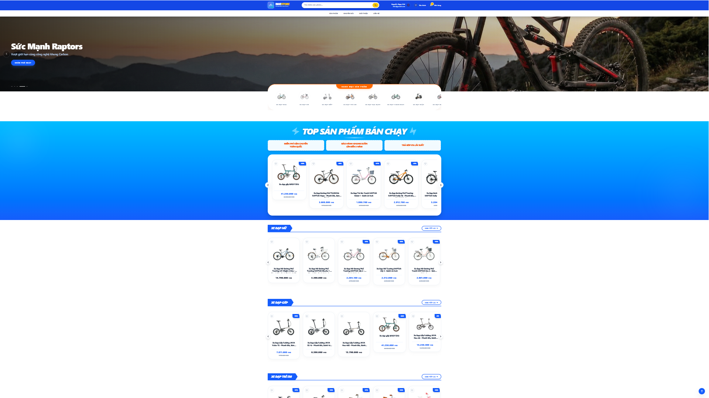
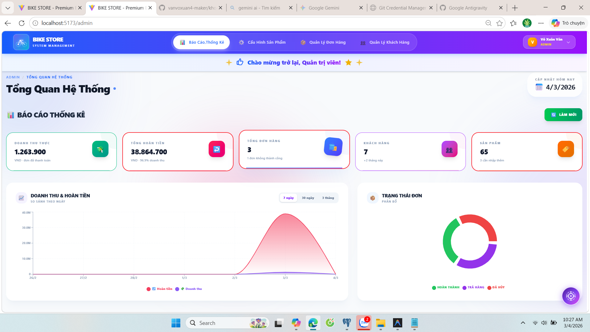
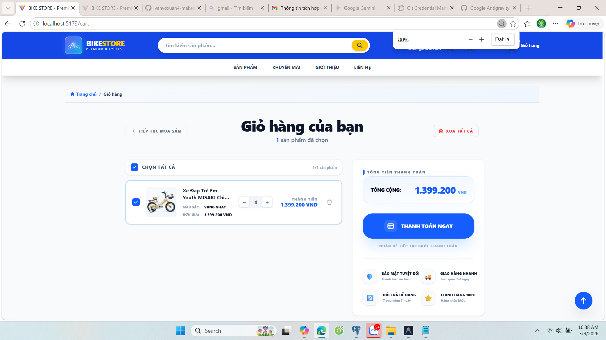
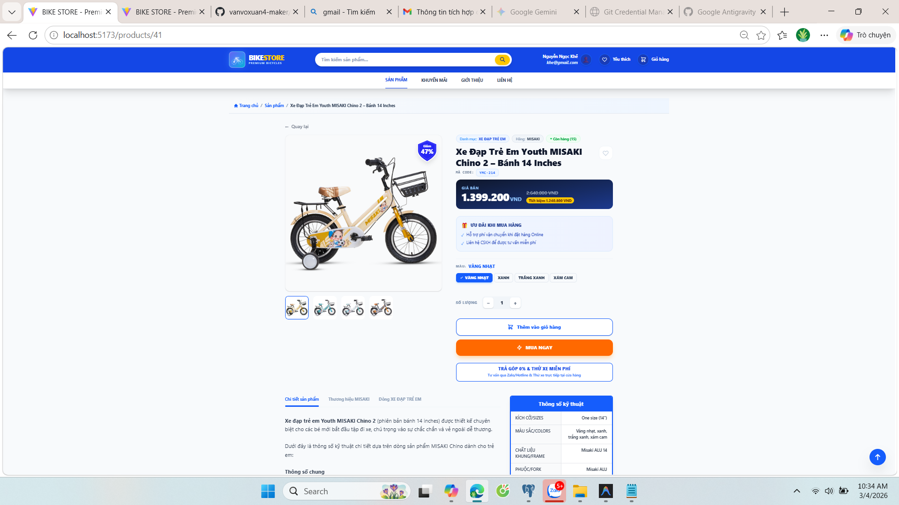

# Bike Shop - Hệ Thống Quản Lý & Bán Xe Đạp Tích Hợp AI


## 📌 Giới Thiệu
Dự án **Bike Shop** là một hệ thống thương mại điện tử chuyên nghiệp dành cho việc kinh doanh xe đạp, được xây dựng với kiến trúc hiện đại (FastAPI + React). Điểm đặc biệt của hệ thống là việc tích hợp **AI Trợ Lý Admin (Gemini 2.0 Flash)** giúp phân tích dữ liệu kinh doanh, báo cáo doanh thu và hỗ trợ marketing định hướng dữ liệu.

---

## 🚀 Tính Năng Nổi Bật

### 1. AI Assistant (Dành cho Admin)
Trợ lý ảo thông minh tích hợp trực tiếp vào hệ thống quản trị:
- **Phân tích doanh thu:** Báo cáo doanh thu theo ngày/tháng bằng ngôn ngữ tự nhiên.
- **Quản trị tồn kho:** Cảnh báo sản phẩm sắp hết hàng dựa trên ngưỡng thiết lập.
- **Xử lý content:** Tự động soạn thảo mô tả sản phẩm và nội dung Marketing chuyên nghiệp.
- **Thông minh & Linh hoạt:** Cơ chế **Intelligent Fallback** hoạt động ngay cả khi vượt quá hạn ngạch API.

### 2. Trải Nghiệm Khách Hàng (Customer)
- **Mua sắm thông minh:** Tìm kiếm, lọc sản phẩm theo nhu cầu (giá, thương hiệu, danh mục).
- **Giỏ hàng & Yêu thích:** Quản lý danh sách mua sắm tiện lợi.
- **Thanh toán đa dạng:** Hỗ trợ COD, Chuyển khoản ngân hàng, Thẻ tín dụng.
- **Đánh giá & Phản hồi:** Hệ thống đánh giá sao và bình luận sau khi mua hàng.

### 3. Quản Trị Hệ Thống (Admin Dashboard)
- **Quản lý toàn diện:** Sản phẩm, Đơn hàng, Danh mục, Thương hiệu, Ưu đãi.
- **Quản lý người dùng:** Banned/Unbanned, theo dõi lịch sử mua hàng.
- **Thống kê chuyên sâu:** Top 10 sản phẩm bán chạy, tỷ lệ hủy đơn, biểu đồ doanh thu.
- **Bảo mật:** Phân quyền chặt chẽ thông qua JWT (JSON Web Token).

---

## 💻 Công Nghệ Sử Dụng

### Backend
- **Framework:** FastAPI (Python)
- **Database:** PostgreSQL/MySQL (SQLAlchemy ORM)
- **AI:** Google Generative AI (Gemini 2.0 Flash)
- **Auth:** JWT Authentication, Bcrypt Password Hashing

### Frontend
- **Framework:** React.js (Vite)
- **Styling:** Tailwind CSS
- **State Management:** React Context API
- **HTTP Client:** Axios

---

## 💎 Kỹ thuật Tối ưu & Điểm nhấn Công nghệ

Dự án không chỉ dừng lại ở các tính năng cơ bản mà còn được tinh chỉnh sâu về mặt kỹ thuật để đạt hiệu suất và độ ổn định cao:

### 1. Frontend Performance Optimization
- **Component Memoization:** Sử dụng `React.memo` với custom equality checks cho các component quan trọng như `ProductCard`, giúp ngăn chặn hoàn toàn việc re-render dư thừa khi dữ liệu không đổi.
- **Hook Caching Thông Minh:** Phát triển hook `useStaticData` với cơ chế **Session-level Cache**. Dữ liệu danh mục và thương hiệu chỉ được fetch một lần duy nhất trong suốt phiên làm việc, giảm hơn 70% số lượng API call dư thừa khi điều hướng.
- **Lazy Loading & Decoding:** Áp dụng `loading="lazy"` và `decoding="async"` cho toàn bộ hệ thống hình ảnh sản phẩm, tối ưu hóa tốc độ tải trang (LCP) và trải nghiệm cuộn mượt mà.

### 2. Backend & Database Tuning
- **High-Performance Indexing:** Thiết lập các Composite Index và B-Tree Index chuyên sâu trên bảng `donhang` và `sanpham`, tối ưu hóa tốc độ tìm kiếm và sắp xếp ngay cả khi dữ liệu lớn.
- **Concurrency Control:** Sử dụng cơ chế khóa dòng `with_for_update()` trong SQLAlchemy để xử lý tranh chấp tồn kho (Race Condition) khi nhiều người dùng cùng đặt hàng một lúc, đảm bảo tính toàn vẹn dữ liệu tuyệt đối.
- **Intelligent API Design:** Tích hợp **Pydantic Model Validation** chặt chẽ, đảm bảo dữ liệu đầu vào luôn sạch và đúng định dạng trước khi xử lý.

### 3. Developer & User Experience (DX/UX)
- **Global Error Interceptor:** Hệ thống xử lý lỗi tập trung thông qua **Axios Interceptor**, tự động nhận diện và thông báo lỗi 401, 403, 500 và lỗi kết nối mạng (Network Error) một cách chuyên nghiệp.
- **URL-based Filter Persistence:** Đồng bộ hóa bộ lọc sản phẩm trực tiếp với URL Search Params, cho phép người dùng chia sẻ kết quả tìm kiếm dễ dàng và giữ trạng thái lọc ngay cả khi tải lại trang.
- **Smart Scroll Logic**: Cơ chế cuộn trang thông minh, chỉ tự động kéo lên đầu khi chuyển trang (pagination) và giữ nguyên vị trí khi thực hiện lọc/sắp xếp, tạo cảm giác tự nhiên nhất.

---

## 🛠️ Hướng Dẫn Cài Đặt (Cách nhanh nhất)

Hệ thống đã được Docker hóa toàn bộ. Người dùng không cần cài đặt Python, NodeJS hay PostgreSQL thủ công.

### 1. Yêu cầu hệ thống
- Đã cài đặt [Docker Desktop](https://www.docker.com/products/docker-desktop/).
- Đảm bảo các cổng **3000** (Frontend), **8000** (Backend) và **5432** (Database) đang trống.

### 2. Khởi chạy với 1 lệnh duy nhất
Mở Terminal tại thư mục gốc của dự án và chạy:
```bash
docker-compose up --build
```
Hệ thống sẽ tự động build, cài đặt thư viện và nạp dữ liệu mẫu từ `init_db.sql`.

### 3. Truy cập hệ thống
- **Giao diện người dùng:** [http://localhost:3000](http://localhost:3000)
- **Tài liệu API (Swagger):** [http://localhost:8000/docs](http://localhost:8000/docs)
- **Tài khoản Admin:** `admin` / Mật khẩu: `admin@123` (Dữ liệu mẫu).

---

## 📸 Hình Ảnh Dự Án
*(Vui lòng cập nhật hình ảnh giao diện tại đây)*





---

## 👤 Tác Giả
- **Võ Xuân Văn**
- **Email:** vanvoxuan4@gmail.com
- **Dự án:** Đề tài thực tập tốt nghiệp 2026

---
*Dự án được phát triển với mục tiêu mang lại giải pháp công nghệ hiện đại cho ngành bán lẻ xe đạp.*
